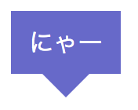

フロントエンド社内勉強会(1)

# 疑似要素!!<br>劇的ビフォーアフター

2020/08/05(Wed.)

T.Morinaga

---

## 内容
* はじめに
* 疑似要素とは
* なぜ必要？
* 実例
* 使用上の注意

---

## はじめに
* 社内勉強会でやって欲しい内容を募集


>>>

### 挙がったもの
* 疑似要素(::before、::after)<br>　→ 第1回
* AMP<br>　→ 第2回

---

## 疑似要素とは
* https://developer.mozilla.org/ja/docs/Web/CSS/Pseudo-elements
* セレクターに付加するキーワード
* 選択された要素の特定の部分に(CSSで)スタイル付けできるようにするもの

---

### ::before疑似要素
* 要素の最初の部分に付加
```
<p>あいうえお</p>
```
```
p::before {
    content: '★';
    color: red;
}
```
* 上記の例の場合「あ」の前に疑似要素が入る


---

### ::after疑似要素
* 要素の最後の部分に付加
```
<p>あいうえお</p>
```
```
p::after {
    content: '●';
    color: blue;
}
```
* 上記の例の場合「お」の後に疑似要素が入る


---

## なぜ必要？
### 疑似要素がない場合

```
<p>
    <span class="before">★</span>
    あいうえお
</p>
```

>>>

疑似要素がないとどうなるか？
* htmlの中身がカオスになる
* 場合によってはSEOに影響する(とも言われている)

---

## ここでちょっと疑問
### 「:」は1つ？2つ？

* CSS2では1つ、CSS3では2つという仕様
* ただしブラウザではどちらでも同様に解釈
* 要するに(今のところは)どっちでもいい

---

## 実例
### その1：箇条書きリストのマーカーを任意の記号に

* html
```
<ul>
    <li>あいうえお</li>
    <li>かきくけこ</li>
    <li>さしすせそ</li>
</ul>
```

>>>

* CSS
```
ul {
    list-style: none;
}
li {
    padding-left: 1em;
}
li::before {
    content: '★';
}
```


---

### その2：吹き出し

* html
```
<div>
    <span>にゃー</span>
</div>
```

>>>

* CSS
```
div {
    display: flex;
    justify-content: center;
    align-items: center;
    width: 70px;
    height: 40px;
    position: relative;
    background-color: #66c;
}
div::after {
    content: '';
    position: absolute;
    top: 100%;
    left: 50%;
    margin-left: -15px;
    border: 15px solid transparent;
    border-top: 15px solid #66c;
}
span {
    color: #fff;
}
```

>>>



---

### その3：テキストのアンダーライン(色付き)

* html
```
<div>
    <p>にゃー</p>
</div>
```

>>>

* CSS
```
p {
    position: relative;
}
p::after {
    content: '';
    position: absolute;
    top: calc(100% + 4px);
    left: 0;
    right: 0;
    height: 2px;
    background-color: #0000ff;
}
```


---

## 実際に使用しているサイト例

* [GC公式・リスティング広告運用代行頁](https://www.glad-cube.com/service/listing.html)

---

## 使用上の注意
* テキストがなくても「content」は必須
* HTMLはスッキリするが使いすぎると今度はCSSがカオスに

---

## まとめ
* 要素の先頭/末尾に付加するものが::before/::after疑似要素
* htmlだけで書こうとするとカオスになる場合オススメ
* htmlがスッキリするがCSSがカオスになるので使用時はバランスを考えて
