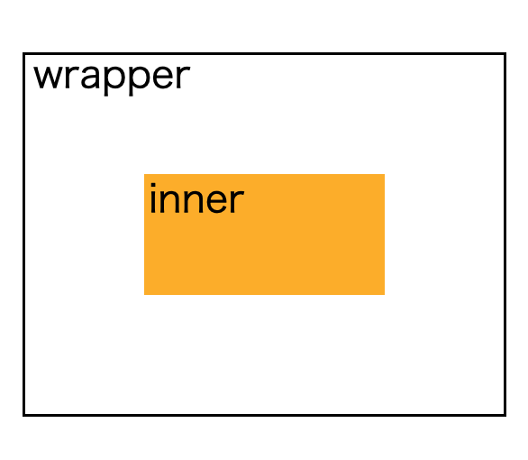
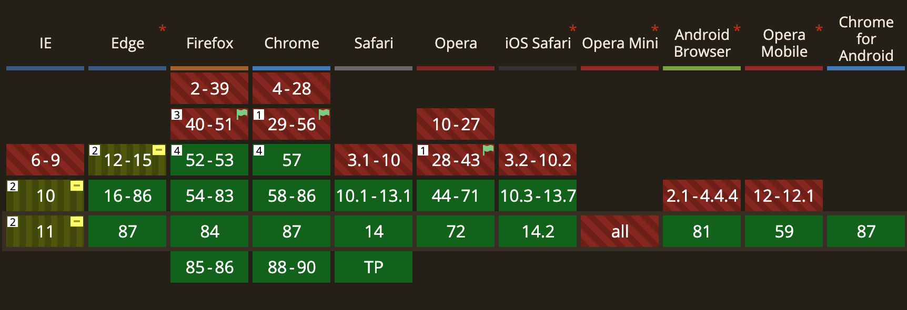

フロントエンド社内勉強会(2)

# レイアウト<br>今昔物語

2020/12/17(Thu.) T.Morinaga

---

## 内容
* はじめに
* 昔のレイアウト
* 最近のレイアウト
* まとめ

---

## はじめに

* 第2回のお題 → 最初は「AMP」の予定だった
* しかし、AMPを使うメリットが薄れつつある
* お題再募集 → レイアウト中心に行うことに

---

いきなりですが

---

### 問題

次のように内部のdiv要素を中央寄せしたい時<br>
CSSの「？」部分に記載する内容を答えよ。

<div style="width:80%; margin:auto">


</div>

---

### 一番あかんやつ

<div class="two-column">
<div class="left">

```
.inner {
    margin-top: 100px;
    margin-left: 100px;
}
```

* 値を直接指定する<br>→ 汎用性ゼロ

</div>
<div class="right">



</div>
</div>

---

### 昔流行ったやつ

<div class="two-column">
<div class="left">

```
.wrapper {
    position: relative;
}
.inner {
    position: absolute;
    top: 0;
    bottom: 0;
    left: 0;
    right: 0;
    margin: auto;
}
```

* コードが長い
* 他要素との兼ね合いで上手くいかないことも多い

</div>
<div class="right">


</div>
</div>

---

### 昔流行ったやつ(2)

<div class="two-column">
<div class="left">

```
.wrapper {
    position: relative;
}
.inner {
    position: absolute;
    top: 50%;
    left: 50%;
    transform: translateX(-50%) translateY(-50%);
}
```

* 一応今でも使えなくはない
* が、やはりコードが長い

</div>
<div class="right">


</div>
</div>

---

### 多分最近はこれが主流

<div class="two-column">
<div class="left">

```
.wrapper {
    display: flex;
    justify-conetnt: center;
    align-items: center;
}
```

* 3行で可能
* IEも10以降で対応

</div>
<div class="right">


</div>
</div>

---

### 今後流行るかも？

<div class="two-column">
<div class="left">

```
.wrapper {
    display: grid;
    place-items: center;
}
```

* わずか2行！
* ただしplace-itemsがIE/旧Edge/iOS(10まで)で非対応
  + 上記の古いブラウザが完全に廃れたら主流になりそう

</div>
<div class="right">


</div>
</div>

---

……といった感じで<br>レイアウトの手法もいろいろあります

---

## 昔のレイアウト

<div class="two-column">
<div class="left">

### テーブルレイアウト

* table/tr/td要素を駆使してレイアウト
* tableは表のためのものという原則から使われなくなった

</div>
<div class="right">


</div>
</div>

---

## 昔のレイアウト

<div class="two-column">
<div class="left">

### floatレイアウト

* floatで左側、右側のレイアウトを設定
* これも使われなくなった
  + 位置、幅、高さの設定が面倒
  + float本来の目的から逸れる

</div>
<div class="right">


</div>
</div>

---

## 今のレイアウト

* float
* Flexbox
* CSS Grid Layout

---

### float

* テキスト、画像の回り込みを行う
* 代替方法がないためこの方法であればまだ利用価値あり


---

### Flexbox

* 親要素(flex container)と子要素(flex item)で構成


---

#### Flexboxでできること

* 親要素のサイズが変化した時の子要素の配置
* 子要素の高さが違う時の上揃え/中央揃え/下揃え
* 子要素の順番入れ替え、サイズ調整
* etc...

**レイアウトが柔軟に(flexible)行える♪**

---

#### Flexbox サンプル(1)

グロナビ

https://codepen.io/t_morinaga/pen/YNExyz


---

#### Flexbox サンプル(2)

2カラム

https://codepen.io/t_morinaga/pen/bgYroo


---

### CSS Grid Layout

* 親要素(grid container)と子要素(grid item)で構成


---

#### できること

* 2次元の格子(grid)内の縦、横位置を指定して子要素を配置

**従来だと縦横配置のため入れ子が複雑になりがちだった<br>HTMLがめっちゃシンプルに♪**

---

#### CSS Grid Layout サンプル

実際の配置サンプル

https://codepen.io/t_morinaga/pen/EWXgbL


---

### 使用上の注意(1)

* 親要素(flex container / grid container)と子要素(flex item / grid item)でコンポーネントを分ける場合
  + それぞれのコンポーネントでstyleを記載すると**密結合になる**
  + 親要素でまとめてstyle記載する方が吉？

<div style="width:70%; margin:auto">


</div>

---

### 使用上の注意(2)

* CSS Grid LayoutはIE/旧Edgeでは**記述方法が異なる**(また一部機能非対応)
  + Autoprefixerを使うなどして変換して記載



---

### どれが適している？

| float | Flexbox | CSS Grid Layout |
| --- | --- | --- |
| テキスト、画像の回り込み | 1次元方向のレイアウト | 2次元方向のレイアウト |
|  |  |  |

---

## まとめ

* レイアウト方法もいろいろある
* 今はFlexbox/CSS Grid Layoutが主流
  + 回り込み目的のみfloatもあり
* どの方法が良いかはそれぞれの特徴をよく把握して判断
