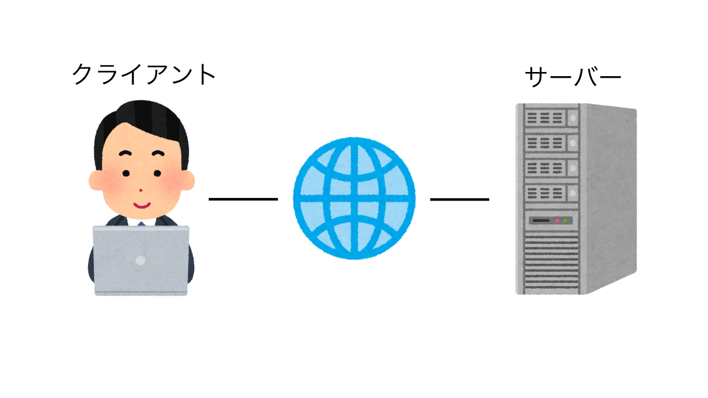
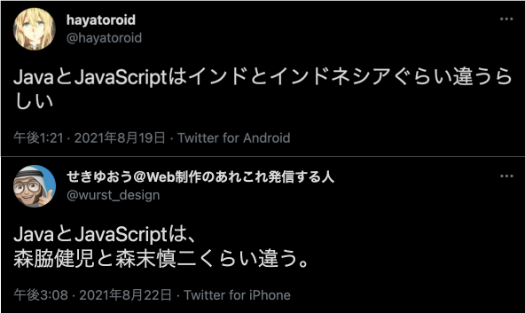

# Web開発/制作以外の人のためのフロントエンド講座

2021.8.26. T.Morinaga

---

## 内容
1. はじめに
2. インターネットとフロントエンドとバックエンド
3. HTML/CSS/JavaScript
4. 何ができるのか？
5. ツールを使ってみよう
6. 最後に

---

## 1. はじめに
### 1.1 目的
* リスティング広告、表示される仕組みや周辺技術を理解せずに運用していませんか？
* 広告、LPのみならずWebサイト全般を支える技術であるHTML/CSS/JavaScriptを学びましょう

---

### 1.2 実務では
* ブラウザを開いてサイトを見てそれで終わりでしょうか？
    * 広告、タグを入れるなどした時にどうやって確認しますか？
* ブラウザ(Chrome)用のdevツールの使い方も紹介しつつ進めていきます
    * 背景技術を理解して使っていくようにしましょう

---

### 1.3 今日やること/やらないこと
#### 今日やること
* 各技術の概要(フロントエンド/HTML/CSS/JavaScript)
* 技術を使った実例
* ツール(Google Chrome用Developerツール)の使い方

#### やらないこと
* コード(HTML/CSS/JavaScript)の書き方、プログラミング

---

## 2. インターネットとフロントエンドとバックエンド
### 2.1 インターネット


---

### 2.2 フロントエンド / バックエンド
#### そもそもの定義
> フロントエンド（英: front-end）とバックエンド（英: back-end）は、プロセスの最初と最後の工程を指す一般的用語である。フロントエンドは各種入力をユーザーから収集し、バックエンドが使える仕様に合うようにそれを加工する。

(Wikipediaより)

---

……なんのこっちゃ？

---

#### フロントエンド
* 「各種入力をユーザーから収集」
* ユーザーがキーボード、マウスで操作する部分
* Webではブラウザで表示、操作する部分
* 主にHTML、CSS、JavaScriptで構成される

---

#### バックエンド
* 「使える仕様に合うようにそれを加工する」
* ユーザーの入力、要求に応じてサーバー側で処理を行いユーザー側に返す
* Node.js、PHP、Pythonなど

---

#### 実際のブラウザで確認してみよう
* command + option + u → ページのソース
    * サーバー側(バックエンド)で生成されたコードを表示する
* command + option + i → 開発ツール
    * ブラウザ側(フロントエンド)で受け取り構成されるHTML/CSS/JS
    * ユーザーの操作によって内容が変化する
    * 編集も可能

---

#### 余談
* 「フロント」と言うと……
    * MS事業部→窓口担当
    * プロダクト開発部→フロントエンド担当
* 混同しないように注意

---

## 3. HTML/CSS/JavaScript
### 3.1 HTMLとは
* HyperText Markup Language
    * HyperText：多数のテキスト文書を相互に関連付け、結び付ける仕組み→要するにリンク
    * Markup：文書構造や視覚表現を意味づけしていく→要するにタグ

#### サンプル
```
&lt;html&gt;
&lt;head&gt;
    &lt;title&gt;sample&lt;/title&gt;
&lt;/head&gt;
&lt;body&gt;
    &lt;p&gt;Hello world!&lt;/p&gt;
&lt;/body&gt;
&lt;/html&gt;
```

---

#### 歴史
* 1989年：CERN(欧州原子核研究機構)のティム・バーナーズ＝リーが考案・開発
    * 当初は「どのように情報や進行中の研究を共有するか」を目的に開発された
* 1993年：IETF(インターネット技術特別調査委員会)により仕様書発表→HTML1.0
* 1999年：HTML4.01(W3C)
* 2014年：HTML5(W3C)
* 2019年：HTML Living Standard(WHATWG)を正式なHTMLとすることでW3CとWHATWGが合意 → 現在に至る

---

### 3.2 CSS
* Cascading Style Sheets
    * Cascading → 上流で定義した内容を引き継ぐ
* Webサイトの色、装飾

#### サンプル
```
span {
  font-size: 24px;
  color: red;
}
```

---

#### 歴史
* 1996年：Cascading Style Sheets, level 1 をW3Cが勧告
* 1998年：CSS2
* 2011年：CSS2.1
* 2012年以降：各モジュールごとに新たな仕様を勧告(いわゆるCSS3)

---

### 3.3 JavaScript
* プログラミング言語の一つ
* Webサイトでの動作、データ収集、ユーザー操作に対する処理などを行う
* 最近ではサーバー側の用途でも使われるように → Node.js

#### サンプル
```
console.log('Hello, world!');
```

---

#### 歴史
* 1995年：Netscape Communicationsのブレンダン・アイクによって開発され、Netscape Navigator2.0に搭載されたのが始まり。
    * 最初は「LiveScript」という名称であったが、業務提携していたサン・マイクロシステムズが開発していた「Java」にあやかって「JavaScript」という名称に
* 1996年：Internet Explorer3.0に搭載されて一気に広まる
* 1997年：EcmaインターナショナルによってECMAScriptとして標準仕様化
* 2015年：ECMAScript2015(バージョン6に相当するがここから毎年アップデート。バージョン番号ではなく年号が付加)

---

#### 余談
* 「Java」と「JavaScript」は名称こそ似ているが全然違う言語です！



---

## 4. 何ができるのか？
### 4.1 それぞれの役割
例えると
* HTML：骨組み
* CSS：内装/外装/装飾
* JavaScript：電気、ガスなどで動くもの

---

## 5. ツールを使ってみよう
### Google Chrome
#### Developerツール
* 起動方法
    * Windows：F12
    * Mac：Command+Option+i

---

#### 実例
* サイト紹介
    * GCトップページ
        * https://www.glad-cube.com/
        * この中でHTML/CSS/JavaScriptがどういった役割を果たしているか

---

#### Developerツールで使える機能
* Console
    * 現在エラーとなっている箇所を表示
    * コード内にログ出力のJavaScriptコードを仕込むことにより状態などを出力可能
    * ここでJavaScriptを入力して実行することも可能
        * サンプル
* Network
    * サーバーとブラウザ間の通信状況
* SP(レスポンシブ)
    * 完璧に再現はできないが参考にはなる

---

* SPAIA
    * アプリ中の表示部分もHTML
        * Web版と同内容をアプリ用にカスタマイズ

---

* このスライド
    * 実はHTML/CSS/JavaScriptでスライドも作れます！
        * [reveal.js](https://revealjs.com/)

---

## 6. 最後に
* HTML/CSS/JavaScriptの技術に関心を持ちましょう
* devツールを活用し、タグの仕組み、HTML/CSS/JavaScriptの動きに着目しましょう
* 今日得た知識を今後の業務に活かしましょう