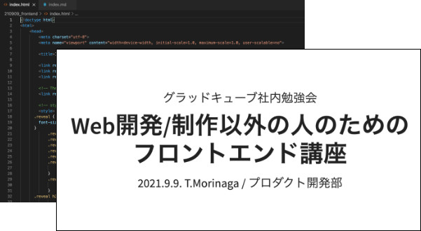

グラッドキューブ社内勉強会

# Web開発/制作以外の人のための<br>フロントエンド講座

2021.9.9. T.Morinaga / プロダクト開発部

---

## 内容
1. はじめに
2. インターネットとフロントエンド/バックエンド
3. HTML/CSS/JavaScript
4. 何ができるのか？
5. ツールを使ってみよう
6. まとめ

---

## 1. はじめに

---

### 1.1 目的
* インターネット広告などについて表示される仕組みや周辺技術を学びましょう
* 広告、LPのみならずWebサイト全般を支える技術であるHTML/CSS/JavaScriptを学びましょう

---

### 1.2 実務への活かし方
* ブラウザを開いてサイトを見る<br>→ 広告、タグを入れるなどした時にどうやって確認すればいいでしょうか？
* ブラウザ(Chrome)用のdevツールの使い方も紹介しつつ進めていきます<br>→ 背景技術を理解して使っていくようにしましょう

---

### 1.3 今日やること/やらないこと
#### 今日やること
* 各技術の概要(フロントエンド/HTML/CSS/JavaScript)
* 技術を使った実例
  * ツール(Google Chrome用Developerツール)の使い方

#### やらないこと
* コード(HTML/CSS/JavaScript)の書き方、プログラミング
* 最近のフロントエンド界隈のトピック(ブラウザなど)

---

## 2. インターネットと<br>フロントエンド / バックエンド

---

### 2.1 インターネット


* クライアント側(端末)を操作することでサーバー側への要求が出される
* ネットワークを通してクライアント側からサーバー側へ要求が送信される
* サーバー側で要求を処理してクライアント側へ返答する

---

### 2.2 フロントエンド / バックエンド
#### そもそもの定義
> フロントエンド（英: front-end）とバックエンド（英: back-end）は、プロセスの最初と最後の工程を指す一般的用語である。フロントエンドは各種入力をユーザーから収集し、バックエンドが使える仕様に合うようにそれを加工する。

(Wikipediaより)

---

……なんのこっちゃ？

---

#### フロントエンド → 「各種入力をユーザーから収集」

* クライアント側(ユーザー)がキーボード、マウスで操作する部分
* Webではブラウザで表示、操作する部分
* 主にHTML、CSS、JavaScriptで構成される


---

#### バックエンド → 「使える仕様に合うようにそれを加工する」

* クライアント側からの要求に応じてサーバー側で処理を行いクライアント側に返す
* Node.js、PHP、Pythonなど


---

#### 実際のブラウザで確認してみよう

* ページのソースを表示
    * Mac：command + option + U
    * Windows：Ctrl + U
    * サーバー側(バックエンド)で生成されたコードを表示する


---

#### 実際のブラウザで確認してみよう

* 開発ツール
    * Mac：command + option + I
    * Windows：Ctrl + Shift + I
    * ブラウザ側(フロントエンド)で受け取り構成されるHTML/CSS/JS
    * ユーザーの操作によって内容が変化する(操作時の状態に寄ってコードが変化する)、編集も可能
    * 詳しい説明は後ほど行います


---

#### 余談

* 「クライアント」と言うと……
    * MS事業部 → 顧客
    * プロダクト開発部 → ユーザーが操作する端末
* 「フロント」と言うと……
    * MS事業部 → 窓口担当
    * プロダクト開発部 → フロントエンド担当
* 混同しないように注意

---

## 3. HTML/CSS/JavaScript

---

### 3.1 HTMLとは

<div class="two-column">
<div class="left">

* HyperText Markup Language
    * HyperText：多数のテキスト文書を相互に関連付け、結び付ける仕組み<br>→ 要するにリンク
    * Markup：文書構造や視覚表現を意味づけしていく<br>→ 要するにタグ

</div>
<div class="right">

#### サンプル
```
&lt;html&gt;
&lt;head&gt;
    &lt;title&gt;sample&lt;/title&gt;
&lt;/head&gt;
&lt;body&gt;
    &lt;p&gt;Hello world!&lt;/p&gt;
    &lt;a href="https://glad-cube.com"&gt;Glad cube&lt;/a&gt;
&lt;/body&gt;
&lt;/html&gt;
```

<small>ブラウザに「Hello world!」とグラッドキューブトップページへのリンクが表示される</small>

<small><a href="sample1.html">動作結果サンプル</a><small>

</div>
</div>

---

#### 歴史
* 1989年：CERN(欧州原子核研究機構)のティム・バーナーズ＝リーが考案・開発
    * 当初は「どのように情報や進行中の研究を共有するか」を目的に開発された
* 1993年：IETF(インターネット技術特別調査委員会)により仕様書発表 → HTML1.0
* 1999年：HTML4.01(W3C)
* 2014年：HTML5(W3C)
* 2019年：<strong>HTML Living Standard</strong>(WHATWG)を正式なHTMLとすることでW3CとWHATWGが合意 → 現在に至る

---

### 3.2 CSS

<div class="two-column">
<div class="left">

* Cascading Style Sheets
    * Cascading<br>→ 上流で定義した内容を引き継ぐ
* Webサイトの色、装飾、レイアウトなど

</div>
<div class="right">

#### サンプル
```
p {
    font-size: 24px;
    color: red;
}
```

<small>pタグ内の文字がサイズ24pxで赤色になる</small>

<small><a href="sample2.html">動作結果サンプル</a><small>

</div>
</div>

---

#### 歴史
* 1996年：Cascading Style Sheets, level 1 をW3Cが勧告
* 1998年：CSS2
* 2011年：CSS2.1
* 2012年以降：各モジュールごとに新たな仕様を勧告<br>(いわゆるCSS3)

---

### 3.3 JavaScript

<div class="two-column">
<div class="left">

* プログラミング言語の一つ
    * ブラウザ上で動作する唯一の言語
* Webサイトでの動作、データ収集、ユーザー操作に対する処理などを行う
* 最近ではサーバー側の用途でも使われるように<br>→ Node.js

</div>
<div class="right">

#### サンプル
```
console.log('Hello, world!');
```

<small>コンソール(後ほど説明します)に「Hello, world!」が表示される</small>

<small><a href="sample3.html">動作結果サンプル</a><small>

</div>
</div>

---

#### 歴史
* 1995年：Netscape Communications のブレンダン・アイクによって開発され、Netscape Navigator2.0 に搭載されたのが始まり。
    * 最初は「LiveScript」という名称であったが、業務提携していたサン・マイクロシステムズが開発していた「Java」にあやかって「JavaScript」という名称に
* 1996年：Internet Explorer3.0 に搭載されて一気に広まる
* 1997年：Ecmaインターナショナルによって ECMAScript として標準仕様化
* 2015年：<strong>ECMAScript2015</strong>(バージョン6に相当するがここから毎年アップデート。バージョン番号ではなく年号が付加)

---

#### 余談
* 「Java」と「JavaScript」は名称こそ似ていますが<br><strong>全然違う言語です！</strong>


---

## 4. 何ができるのか？

---

### 4.1 それぞれの役割

* HTML：文書の表示、他文書へのリンク
* CSS：テキストの色、装飾、レイアウト
* JavaScript：表示時およびユーザー操作時のページ内動作


---

#### 家に例えると

* HTML：骨組み
* CSS：内装/外装/装飾
* JavaScript：電気、ガスなどで動くもの


---

## 5. ツールを使ってみよう

---

### Google Chrome
#### Developerツール

* 起動方法
    * キーボード
      * Windows：Ctrl+Shift+i
      * Mac：Command+Option+i
      * 共通：F12
    * 調べたい要素のところで右クリック→「検証」


---

#### 実例

* GCトップページ
    * https://www.glad-cube.com/
    * この中でHTML/CSS/JavaScriptがどういった役割を果たしているか


---

#### Developerツールで使える機能

* Elements
    * 現在開いているページ内で調べたい箇所のHTML/CSS内容を確認できる
    * 編集することも可能(ただしリロードすると元に戻る)
    * HTML内の検索も可能(command + f / Ctrl + f)


---

* Console
    * 現在エラーとなっている箇所を表示
    * コード内にログ出力のJavaScriptコードを仕込むことにより状態などを出力可能
    * ここでJavaScriptを入力して実行することも可能


---

* Network
    * サーバーとブラウザ間の通信状況
    * ページの表示までにどのようなファイルをロードしているか？
    * 通信回数、ステータス
    * ファイルの種類ごとに確認することも可能
    * 「Disable cache」にチェックを入れてリロードするとキャッシュ無効
    * 「No throttling」の箇所を変更することで通信速度シミュレーション可能


---

* SP(レスポンシブ)
    * スマートフォンでの表示内容をシミュレーション
    * 完璧に再現はできないが参考にはなる
    * PC / SPで違う表示となる場合の確認に便利


---

### 実例(2)

<div class="two-column">
<div class="left" style="width: 75%">

#### SPAIA

* アプリ中の表示部分もHTML
    * Web版と同内容をアプリ用にカスタマイズ
    * 画面上部のタイトル表示部分、下部の操作部分はアプリ用の言語で実装
      * React Native / Swift / Kotlin

</div>
<div class="right">


</div>
</div>

---

### 実例(3)

* 実は……このスライドもHTML/CSS/JavaScriptで作成しています！
    * [reveal.js](https://revealjs.com/)



---

## 6. まとめ

---

### まとめ

* HTML/CSS/JavaScript の技術に関心を持ちましょう
* devツールを活用し、タグの仕組み、HTML/CSS/JavaScript の動きに着目しましょう
* 今日得た知識を今後の業務に活かしましょう

---

<b>ご清聴ありがとうございました。</b>
