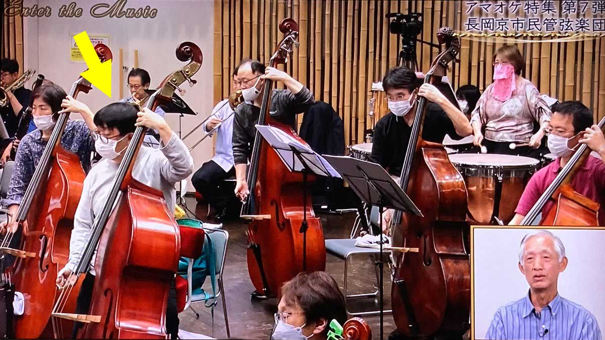
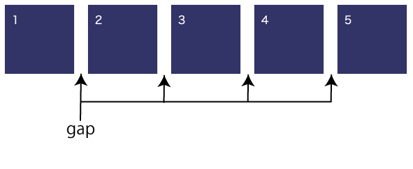
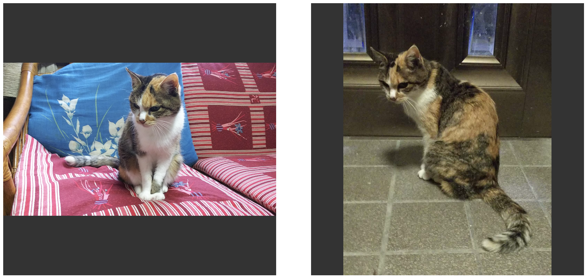
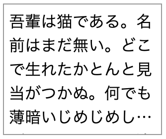
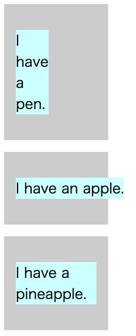
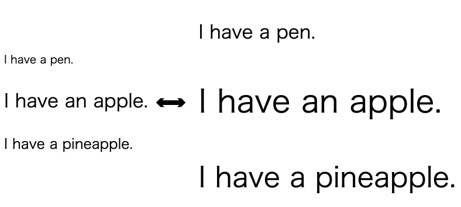
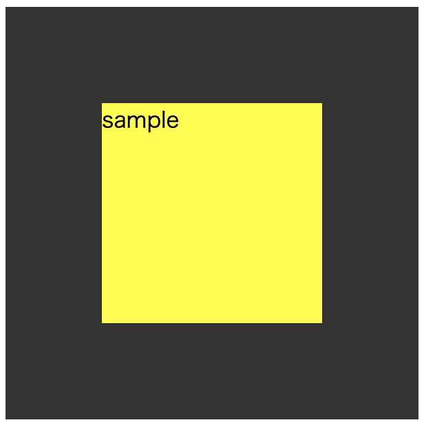

# IE11が消えた世界で<br>実際に役に立ったCSS

2023.1.23. markup meetup #3<br>
もりてつ(森永 哲平)

---

## 自己紹介

<div class="two-columns">
<div class="left wide">

* 名前：森永 哲平(もりてつ)
* お仕事：
  * 株式会社グラッドキューブ<br>プロモーション統括本部<br>プロダクト開発部<br>フロントエンドスペシャリスト
* 経歴：
  * 家電メーカー(1997〜2012年)
  * ソフトウェアメーカー(2013〜2015年)
  * 現職(2015年〜)
* いつの間にか50代
* Twitter：@m_n_t_p

</div>
<div class="right narrow">


</div>
</div>

---

* アマオケでコントラバス弾いてます
* 昨年所属オケがテレビで紹介されました

<div style="width: 75%; margin: auto;">



</div>

<small>BSテレ東「エンター・ザ・ミュージック」2022年8月13日放送</small>

---

## 今回の内容

* 2022年のブラウザ業界、CSSの変化
* 2022年に実際に役に立ったCSS 5選＋1
* その他、どんなCSSが使えるようになったか

### 今回話さないこと

* 今後新たに使えそうなCSS(まだブラウザ依存のあるもの)

---

## 2022年のブラウザ業界、CSSの変化

* 2022年6月16日に殆んどのPC (※1) でInternet Exploler 11(以下IE11)のサポートが終了
* 今までIE11をサポート対象に入れていたため使えなかったHTML/CSS/JavaScriptの技術がいろいろありましたが、これからは臆することなく使うことができます
  * これまではIE11での対応のために余計な工数が必要でした

<small style="text-indent: -2em; margin-left: 2em;text-align: left;">(※1) Windows10でのサポートが終了であり一部OSはサポート対象として残っていますが、シェアが殆んどないため無視します。また「IEモード」も今回は無視します。</small>

---

* ただ……記事や勉強会でのセッションなどでこの手の話は昨年多数あったが、本当に使っていって役に立つものか？


* そこで今回はIE11でサポートされていなかった多くのCSSのうち、実際に役に立ったもの5個＋番外編1つをランキング形式でピックアップしました

---

### 注意

* ランキングは個人の感想＆独断と偏見です<br><small class="margin-top: 0.5em">皆さんの役に立つかどうかは当然個人差があります</small>


---

## 第5位
### gap (for Flexbox)
* CSS Grid LayoutのみならずFlexboxでもitem間の間隔が指定できるようになりました
* これまでは(値を決め打ちする場合は)item側にmarginを指定していました
  * :last-childなどで特別な指定が必要なケースが多い

---

<div class="two-columns">
<div class="left">

* [サンプル](https://codepen.io/t_morinaga/pen/zYLROLm)

```
.container {
  display: flex;
  width: 100%;
  gap: 20px; ←ここがポイント
}
.item {
  (省略)
}
```

</div>
<div class="right">



</div>
</div>

---

## 第4位
### object-fit
* 領域(コンテナ)内に置換要素(画像など)を良しなにはめ込んでくれる便利なもの
    * contain を指定するとアスペクト比そのままで領域に入るように調整してくれます
    * cover を指定すると領域全体に入るように調整されます
* 今までは画像の縦横をscriptでチェックして……などいろいろやらないとダメでした
* 某スポーツ新聞のサイトで採用
    * 写真のアスペクト比が異なる場合 object-fit が役に立ちました

---

<div class="two-columns">
<div class="left">

* [サンプル](https://codepen.io/t_morinaga/pen/OJwQMZG)

```
img {
    display: inline-block;
    width: 512px;
    height: 512px;
    margin: 0 30px;
    object-fit: contain; ←ここがポイント
    background-color: #333333;
}
```

</div>
<div class="right">



</div>
</div>

---

## 番外編
### -webkit-line-clamp
* 複数行のテキストで末尾を「…」にするもの
* これまで1行では(text-overflowで)可能だったが複数行はJavaScriptの助けを借りないとダメでした
  * ようやく複数行で対応できるように
* ただし「line-clamp」は(CSS3仕様にはあるものの)ブラウザ側でまだ採用されておらずベンダープレフィックスが必要(なぜかFirefoxでも-webkit)
  * このためランク外(番外編)としました
* また、display: -webkit-box、 -webkit-box-orient: vertical、 overflow: hidden の3つを指定しないと指定行数で切られずにはみ出ます

---

<div class="two-columns">
<div class="left">

* [サンプル](https://codepen.io/t_morinaga/pen/wvxyBxV)

```
.title {
    display: -webkit-box; ← セットで必要
    -webkit-line-clamp: 5; ← ここで上限行数指定
    -webkit-box-orient: vertical; ← セットで必要
    overflow: hidden; ← セットで必要
}
```

</div>
<div class="right">



</div>
</div>

---

## 第3位
### min-content / max-content / fit-content
* width/heightに指定するキーワード
* min-content: コンテンツが取りうる最小の幅(テキストコンテンツの場合単語途中で折り返しが発生しない最小幅)
* max-content: コンテンツが取りうる最大の幅(テキストコンテンツの場合はみ出ても折返しが発生しない)
* fit-content: 領域内に入るように調整。ただしmax-contentを超えず、min-contentを下回らない

---

<div class="two-columns">
<div class="left">

* [サンプル](https://codepen.io/t_morinaga/pen/KKoKMPW)

```
.min {
  width: min-content;
}
.max {
  width: max-content;
}
.fit {
  width: fit-content;
}
```

</div>
<div class="right">



</div>
</div>

---

## 第2位
### min() / max() / clamp()
* min(): カッコ内に入る複数の値から最小の値を適用します
* max(): カッコ内に入る複数の値から最大の値を適用します
* clamp(): カッコ内に引数が3つ入り最小値 / 推奨値(デフォルト値) / 最大値が入ります
* レスポンシブデザインで有用

---

<div class="two-columns">
<div class="left">

* [サンプル](https://codepen.io/t_morinaga/pen/WNzNxRp)

```
.min {
  font-size: min(32px, 5vw);
}
.max {
  font-size: max(32px, 5vw);
}
.clamp {
  font-size: clamp(24px, 5vw, 48px);
}
```

</div>
<div class="right">



</div>
</div>

---

## 第1位
### place-items
* align-items と justify-items の一括指定
* これを応用していわゆる「中央寄せ」を2行で実現！
  * ただし子要素が1つの場合のみ有用。2つ以上の場合はどうしても3行になります

---

<div class="two-columns">
<div class="left">

* [サンプル](https://codepen.io/t_morinaga/pen/PoBQwxv)

```
.container {
  display: grid;
  place-items: center;
}
```

</div>
<div class="right">



</div>
</div>

---

## その他
* 今回紹介できなかったものも多数あります
  * position: sticky
  * scroll-margin-top
  * :is()
  * CSS Variables (Custom Properties)
  * etc...

### Chrome(現バージョン)とIE11の比較
* [Can I use](https://caniuse.com/?compare=chrome+109,ie+11&compareCats=CSS) で比較一覧を見ることが出来ます

---

## ランキング一覧

* 第1位：place-items
* 第2位：min() / max() / clamp()
* 第3位：min-content / max-content / fit-content
* 第4位：object-fit
* 第5位：gap (for Flexbox)
* 番外：-webkit-line-clamp

---

## まとめ
* IE11対応のために断念せざるをえなかったCSSが多数使えるようになりました
* 役に立ちそうなものは積極的に使っていき工数削減に役立てていきましょう
  * ただし急に詰め込もうとせずぼちぼちと変えていきましょう


---

# 終

ご清聴ありがとうございました
