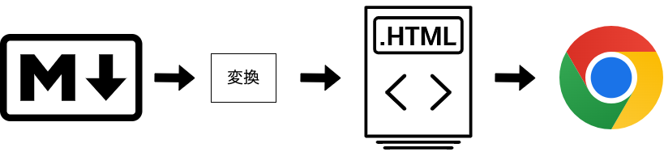
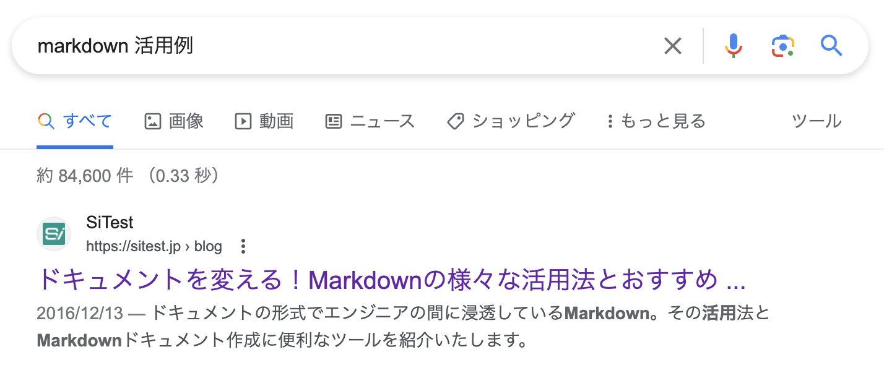
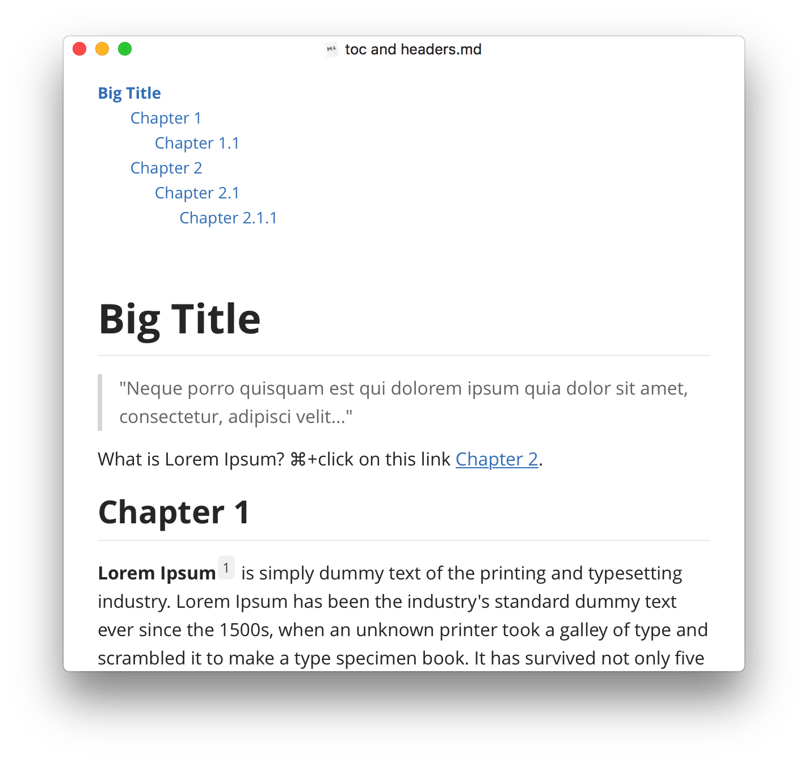

# Markdownノススメ
## - メモ書きからプレゼン資料まで -

2023.10.25.(Wed.) 技術情報共有会  
T.Morinaga

---

## お品書き
* Markdownとは
* 書き方
* いろいろな活用例
* ツール

---

## Markdownとは
* プレーンテキストで記述
* 見出し、強調、リスト(箇条書き)などについて文法が存在し、簡単にHTML文書に変換することができるマークアップ言語
* 2004年にジョン・グルーバーによって開発


---

### 変換の仕組み
Markdown → 【変換】 → HTML → ブラウザで表示



---

### メリット
* シンプルでわかりやすい
    * タグを書く必要が(ほぼ)ない
    * ぶっちゃけHTML変換前のプレーンテキスト状態でも内容を把握しやすい
* HTML変換+CSSによってスタイリング可能
* さらにPDFなどへ変換するツールなども多数出回っている(後述)

---

## 書き方
### 主な文法ルール
* 段落は空行で、一行開ける
* 見出しは行頭に「#」。「#」の数で見出しのレベルを調節可能  
  (1つでHTMLで言うh1タグ相当、2つでh2タグ相当、以下「#」を増やしていくことにより同等のタグ相当)
* 強調したい部分を 「**」 で囲む
* 箇条書きは行頭に 「-」 (または「+」「*」も可)
* リンクは [ ] でリンクしたい文字を囲って、その直後の ( ) の中にURLを書く

---

#### 補足
* 上記以外にもいろいろルールが有る
* HTMLタグを入れることも可能  
  (ルールにないマークアップをしたい場合に有効)

---

### 例
```
### Markdownについて

**Markdown**は基本的にプレーンテキストで記述されている文書なのですが、

- 見出し
- 強調
- リスト(箇条書き)

などについて文法が存在し、簡単にHTML文書に変換することができるマークアップ言語です。[2004年にジョン・グルーバーによって開発されました](http://daringfireball.net/projects/markdown/)。
```

---

### 出力結果

<div class="output">

### Markdownについて

**Markdown**は基本的にプレーンテキストで記述されている文書なのですが、

- 見出し
- 強調
- リスト(箇条書き)

などについて文法が存在し、簡単にHTML文書に変換することができるマークアップ言語です。[2004年にジョン・グルーバーによって開発されました](http://daringfireball.net/projects/markdown/)。

</div>

---

## いろいろな活用例
<div class="two-columns">
<div class="left">

### メモ書き、議事録
* 箇条書きなどでの整理がしやすい
* 素のMarkdownでももちろん、HTMLに変換するとさらに見やすい

</div>
<div class="right">


</div>
</div>

---

### ドキュメント記載
* 各種Wikiサービス等
    * Backlog
    * GitHub
* ブログ
    * 最近のブログサービスではMarkdownでの記載形式として採用している所も多い
    * また、SSGでMarkdownの文書に対応しているものも多数あり

---

### プレゼン資料
<div class="two-columns">
<div class="left">

* Markdownからプレゼン資料に変換するツールもある！(後述)
* 実はこの資料もMarkdownベース

</div>
<div class="right">


</div>
</div>

---

### ちなみに
「Markdown 活用例」で検索すると……  
なんと[7年前に私の書いたブログ](https://sitest.jp/blog/?p=4589)が一番上に登場

<div class="output">



</div>

---

## ツール
### エディタ
#### Visual Studio Code
* ド定番
* 拡張子「.md」のファイルは自動的にMarkdownと認識して自動整形、ハイライトなどをしてくれる
    * これは他のエディタでも対応しているものが多い
    * command+k → v でプレビュー表示
* PDFへの変換もしてくれる拡張機能あり
    * Markdown PDF

---

#### Markdown専用エディタ

<div class="two-columns">
<div class="left">

##### MacDown
* https://macdown.uranusjr.com/
* mac専用
* 2カラムで入力しながらHTML変換後の出力も確認可能
* ただし2020年1月からバージョンが上がっていない

</div>
<div class="right">


</div>
</div>

---

<div class="two-columns">
<div class="left">

##### Typora
* https://typora.io/
* 各プラットフォーム対応
* シンプルなUIながらかなり多機能
* テーマも充実
* ただし有料(v1以降、$14.99)

</div>
<div class="right">



</div>
</div>

---

### 他の形式への変換
#### Pandoc
* CLIツール
* Haskellで作られている
* https://pandoc.org/
* 日本Pandocユーザ会：<br>https://pandoc-doc-ja.readthedocs.io/ja/latest/
* Markdownに限らず多数のファイル形式で相互変換可能
* PDFへの変換は専用エンジンのインストールが別途必要

<div class="command">

```
pandoc sample.md -o sample.html
```

</div>

---

#### プレゼン資料
##### Marp
* https://marp.app/
* Markdown(若干の方言あり)をプレゼン用スライドに変換する
* 専用テーマが3種類あり、CSSで拡張可能
* 昔は専用アプリ(Electron製)があったが開発中止
* 新バージョンはフレームワーク「Marpit」をベースとしたいろいろなツール、アプリ
    * VS Code用拡張機能やCLIツールがある

---

##### reveal.js
* https://revealjs.com/
* HTMLをプレゼン資料として見せるためのフレームワーク
* 本文のところをMarkdown形式で記述可能
    * Markdownの外部ファイルをimportすることも可能
* **この資料もreveal.jsを使っています**

---

### オンラインサービス
#### HackMD
* https://hackmd.io/
* Markdown特化型(若干独自の方言あり)
* 公開も簡単(閲覧/編集対象ユーザー設定も可能)
* Import/Export機能などいろいろ充実
* 森永はこれを共有ドキュメントでよく使っています

---

#### StackEdit
* https://stackedit.io/
* HackMD同様にMarkdown特化型のオンラインエディタ
* Markdown ＋ 拡張記法に対応
    * LaTeX mathematical expressions
    * UML diagrams
    * etc...

---

#### その他
* Markdown記法、文書に対応しているサービスが多数あり
    * GitHub
    * Backlog
    * Notion
    * Dropbox
    * 各ブログサービス
    * etc...

---

## ということで

<div class="two-columns">
<div class="left">

Markdownはいろいろ使えるのでエンジニアもそうでない方もガンガン活用していきましょう

</div>
<div class="right">


</div>
</div>
